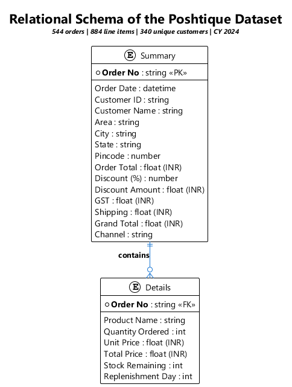
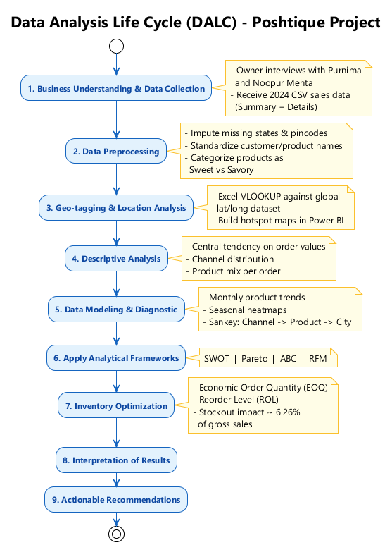
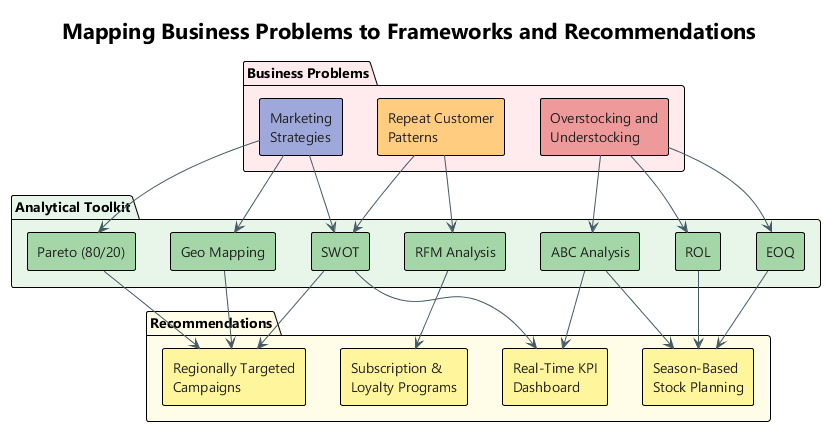
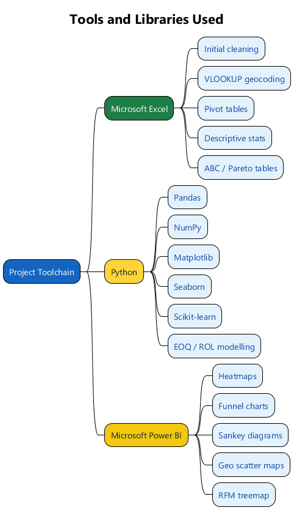

# A Bite into the Data
### A Comprehensive Deep Dive into a Healthier Snacking Business

> End-to-end Business Data Analysis on a year of order-level sales data for **Poshtique**, a Mumbai-based healthy snacking startup. Built as the **Business Data Management (BDM) Capstone Project** for the IITM Online BS Degree Program.

[]()
[]()
[]()
[]()
[]()

---

## Table of Contents
1. [Project Snapshot](#project-snapshot)
2. [The Business: Poshtique](#the-business-poshtique)
3. [Problem Statements](#problem-statements)
4. [Dataset](#dataset)
5. [Analysis Pipeline](#analysis-pipeline)
6. [Analytical Frameworks](#analytical-frameworks)
7. [Tools and Libraries](#tools-and-libraries)
8. [Key Findings](#key-findings)
9. [Recommendations](#recommendations)
10. [Repository Structure](#repository-structure)
11. [Reproducing the Diagrams](#reproducing-the-diagrams)
12. [Author](#author)

---

## Project Snapshot

| Item | Value |
| --- | --- |
| **Author** | Henil Diwan (Roll No. 23F1001603) |
| **Programme** | IITM Online BS Degree - BDM Capstone |
| **Partner Company** | Poshtique (a venture by Health Harmony) |
| **Founders** | Purnima Mehta and Noopur Mehta |
| **Industry** | D2C Healthy Snacking (B2C) |
| **Data Window** | Calendar Year 2024 |
| **Orders Analyzed** | 544 |
| **Line Items** | 884 |
| **Unique Customers** | 340 |
| **Gross Sales** | INR 5,05,500 |
| **Net Sales** | INR 6,16,081 |
| **Channels** | Amazon (60%) and Poshtique Online (40%) |

Full submissions:
- [Proposal.pdf](Proposal.pdf)
- [Mid_Term.pdf](Mid_Term.pdf)
- [Final.pdf](Final.pdf)
- [Presentation.pdf](Presentation.pdf)

---

## The Business: Poshtique

Poshtique is a Mumbai-based B2C food and nutrition brand offering guilt-free alternatives to junk food: **Super Seeds, Makhanas, Date Delight, Nutty Choco Date, Granola and Energy Balls**. Born from the founders' family lineage in medicinal practices and a passion for the culinary arts, the brand's promise is *"Let Food be thy Medicine."*

Despite a steady customer base, the company is struggling with:
- Demand forecasting and stock inefficiencies (over/under-stocking)
- Poor visibility into repeat customer behavior
- Marketing campaigns that don't translate into traction

This project converts a year of raw transactional data into actionable answers.

---

## Problem Statements

| # | Problem | Why it matters |
| - | --- | --- |
| 1 | **Overstocking and Understocking** | Seasonal demand and perishable inventory waste resources and miss sales. |
| 2 | **Repeat Customer Patterns** | No method exists to identify, segment, or nurture returning buyers. |
| 3 | **Marketing Strategies** | Past campaigns lack quantitative customer insight, hurting ROI. |

---

## Dataset

Poshtique provided two relationally linked CSV files for all transactions in 2024 (all monetary values in INR):

- [Raw Data Summary.csv](Raw%20Data%20Summary.csv) - 544 rows x 15 cols, one row per order
- [Raw Data Details.csv](Raw%20Data%20Details.csv) - 884 rows x 7 cols, one row per line item

The two files are joined on **Order No** (Summary.PK -> Details.FK).

<p align="center">
  
</p>

### Descriptive statistics highlights

| Metric | Order Total | Grand Total | Unit Price |
| --- | --- | --- | --- |
| Mean | INR 961.95 | INR 1,132.50 | INR 211.37 |
| Median | INR 800.00 | INR 999.00 | INR 200.00 |
| Min / Max | INR 100 / 5,000 | INR 173 / 5,706 | INR 100 / 350 |
| Std. Dev. | INR 679.64 | INR 727.80 | - |

> 50% of orders received **no discount**, the maximum discount offered was **40%**, and shipping was a near-constant ~INR 104 across orders.

---

## Analysis Pipeline

The project follows a textbook **Data Analysis Life Cycle (DALC)** with an additional geo-tagging stage to enable spatial analysis.

<p align="center">
  
</p>

---

## Analytical Frameworks

Each business problem is attacked with a focused mix of inventory science and customer analytics. The map below shows how each problem flows through frameworks into concrete recommendations.

<p align="center">
  
</p>

| Framework | What it answers | Where applied |
| --- | --- | --- |
| **SWOT** | Strategic position of the brand | Whole business |
| **Pareto (80/20)** | Which SKUs drive most revenue | Product portfolio |
| **ABC Analysis** | Stock prioritization tiers | Inventory |
| **RFM Analysis** | Customer value segmentation | Customer base |
| **EOQ** | Optimal order quantity | Per SKU |
| **ROL** | Reorder threshold | Per SKU |
| **Geo-mapping** | Demand hotspots | India + Mumbai sub-regions |

---

## Tools and Libraries

<p align="center">
  
</p>

- **Microsoft Excel** - Cleaning, geocoding via VLOOKUP, pivot tables, descriptive stats, ABC and Pareto tables.
- **Python** - Pandas, NumPy, Matplotlib, Seaborn and Scikit-learn for advanced modeling, EOQ/ROL plots and visualizations.
- **Microsoft Power BI** - Heatmaps, funnel charts, Sankey diagrams, geo scatter maps and the RFM treemap.

---

## Key Findings

### 1. Product Performance (ABC + Pareto)

| Class | Product | Revenue | % of Revenue | Note |
| --- | --- | --- | --- | --- |
| **A** | Super Seeds | INR 1,25,400 | 24.81% | Top seller, steady year-round demand |
| **A** | Granola | INR 1,10,400 | 21.84% | Lower quantity, higher unit price |
| **A** | Date Delight | INR 1,07,500 | 21.27% | Strong festival spikes |
| **B** | Nutty Choco Date | INR 68,950 | 13.64% | Volatile, festival-driven |
| **C** | Makhanas | INR 48,100 | 9.52% | High volume, low unit price |
| **C** | Energy Balls | INR 45,150 | 8.93% | Underperformer, candidate for repositioning |

Super Seeds + Granola + Date Delight contribute roughly **68% of revenue**, confirming the Pareto principle.

### 2. Inventory Inefficiency

- **27 stockout events** across six products in 2024
- **133 days** with at least one product out of stock
- **Lost revenue ~ INR 31,649** = **~6.26% of gross annual sales**
- **Granola** suffers the largest revenue loss (~INR 9,708) due to stockouts

EOQ and ROL were computed per SKU to enable proactive restocking:

| Product | EOQ | ROL |
| --- | --- | --- |
| Super Seeds | 158.4 | 28.5 |
| Granola | 121.3 | 11.3 |
| Date Delight | 131.1 | 5.4 |
| Makhanas | 138.7 | 6.9 |
| Energy Balls | 109.7 | 5.8 |
| Nutty Choco Dates | 88.8 | 2.7 |

### 3. Customer Behavior (RFM)

- **Most customers are one-time buyers**, with Amazon contributing the bulk of single-purchase traffic.
- Only **~17% repeat purchase rate** versus a D2C industry average of ~35%.
- RFM segmentation surfaces actionable groups: *Loyal High Spenders, High Value Champions, Mid Value Promising, Hibernating Mid Value, Lost High Value* and *Low Value Customers*.

### 4. Geography

- Orders are heavily concentrated in **Mumbai and Navi Mumbai**, with the **West and South** sub-regions dominating.
- Emerging demand in **Bangalore, Hyderabad, Pune and Ahmedabad**.
- Tier-2 cities such as **Sangli, Nasik and Malegaon** show steady demand and untapped potential.

### 5. Seasonality

- **Diwali season** drives a +38% spike, especially for sweet SKUs (Date Delight, Nutty Choco Date).
- Super Seeds and Makhanas show **stable year-round demand**, fitting staple-consumption behavior.

---

## Recommendations

### Inventory
- Plan **larger stock buffers 2-3 months before festivals** for sweet SKUs.
- Restock staples (Super Seeds, Granola) using the **EOQ/ROL** values above instead of reactive zero-stock reordering.
- Run **post-festival clearance** to liquidate seasonal stock.

### Customer Retention
- Launch a **subscription model** for high-velocity SKUs (Super Seeds, Date Delight).
- Introduce a **points-based loyalty program** with gamification (badges, tiers).
- Run **win-back campaigns** for the "Lost High Value" RFM segment.
- Use **channel-specific incentives** to convert one-time Amazon buyers into repeat customers.

### Marketing
- Send **regional-specific samples** (e.g., sweets in Gujarat, seeds in metros).
- Use **Instagram and WhatsApp polls** plus a "Snacking Personality" quiz to gather soft preference data.
- Set up **geographical KPIs** to track acquisition and repeat-rate per region and run A/B tests (Western vs Eastern Mumbai, metro vs tier-2).

### General
- Build a **real-time interactive dashboard** consolidating sales, inventory and customer KPIs so the team can make evidence-based decisions and react quickly to market shifts.

---

## Repository Structure

```
Business-Data-Analysis/
├── README.md                   <- This file
├── Proposal.pdf                <- Phase 1 submission: scope and approach
├── Mid_Term.pdf                <- Phase 2 submission: descriptive analysis
├── Final.pdf                   <- Phase 3 submission: full analysis + recommendations
├── Presentation.pdf            <- Final viva presentation deck
├── Raw Data Summary.csv        <- Order-level dataset (544 x 15)
├── Raw Data Details.csv        <- Line-item dataset (884 x 7)
└── diagrams/                   <- PlantUML sources + rendered PNGs
    ├── data-schema.puml / .png
    ├── analysis-pipeline.puml / .png
    ├── problem-to-solution.puml / .png
    ├── tech-stack.puml / .png
    └── plantuml.jar
```

---

## Reproducing the Diagrams

All architectural diagrams in this README are generated from PlantUML sources in [diagrams/](diagrams/). To regenerate them you need Java 8+ on PATH.

```powershell
cd diagrams
java -jar plantuml.jar -charset UTF-8 -tpng *.puml
```

To export as SVG instead, swap `-tpng` for `-tsvg`.

---

## Author

**Henil Diwan**
- Roll No: 23F1001603
- IITM Online BS Degree Program
- Indian Institute of Technology, Madras

> Data shared by Poshtique under a No Objection Certificate signed by founder Noopur Mehta. All findings and recommendations are project-specific and not endorsed by IIT Madras.
